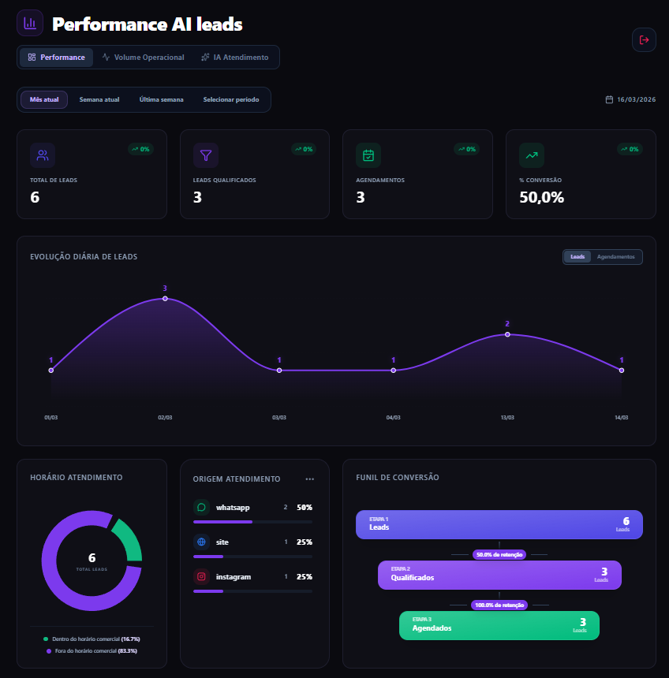
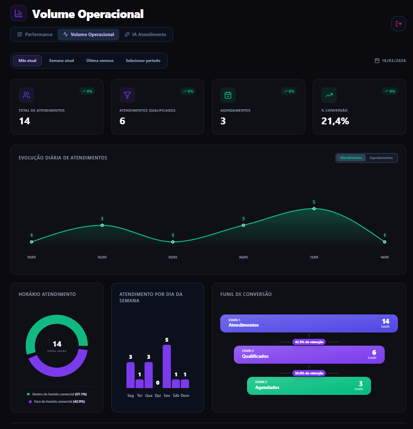
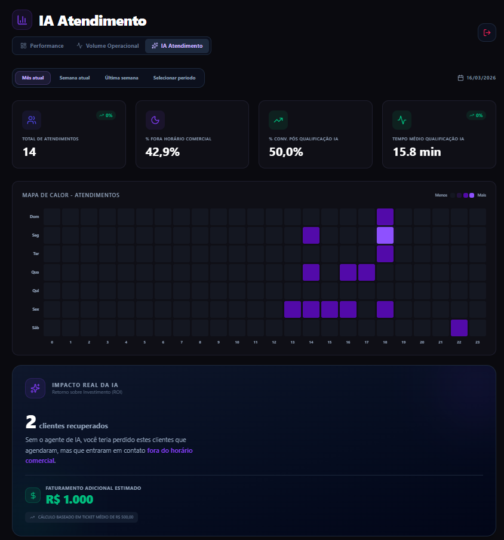

# 📊 Dashboard

O dashboard foi desenvolvido para acompanhar o desempenho do atendimento automatizado com IA e medir o impacto na geração de agendamentos.

Os dados são estruturados em banco relacional e alimentados automaticamente a partir das interações entre usuários, agente de IA e atendentes humanos.

---

# 🎯 Objetivo

Permitir que a clínica acompanhe:

- volume de leads recebidos (leads únicos)
- volume de atendimentos (atendimentos considerando uma janela de tempo que define o que é novo atendimento) -> 1 lead único pode ter mais de 1 atendimento. Exemplo: o lead X fez outro contato 7 dias depois é considerado um novo atendimento, caso contrário não.
- qualidade dos leads
- eficiência do pré-atendimento automatizado
- conversão em agendamentos
- origem dos contatos
- importância do agente de IA (% de atendimentos fora do horário comercial e qualificação)

Essas informações permitem **otimizar o processo comercial e reduzir perda de oportunidades**.

---

# 📈 Principais Métricas

O dashboard acompanha as seguintes métricas:

- Total de leads recebidos
- Leads qualificados
- Atendimentos realizados
- Agendamentos realizados
- Taxa de conversão
- Origem dos leads (WhatsApp / Instagram)
- Evolução temporal dos atendimentos/agendamentos
- Funil de conversão
- Mapa de calor de atendimentos (dia e horário)
- Entre outras

---
# 📊 Visualizações

## Visão Leads únicos

## Visão atendimentos

## Performance IA

